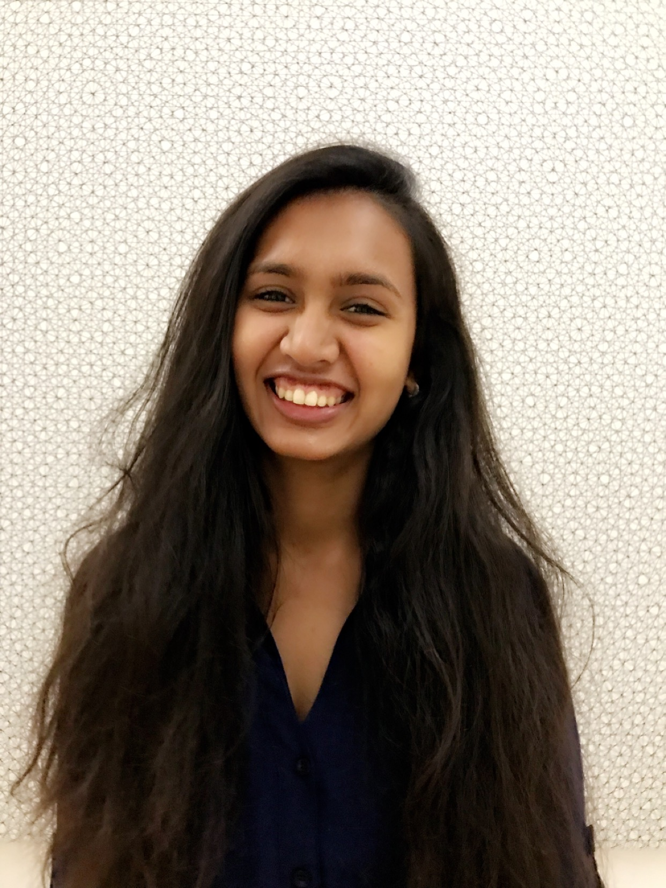
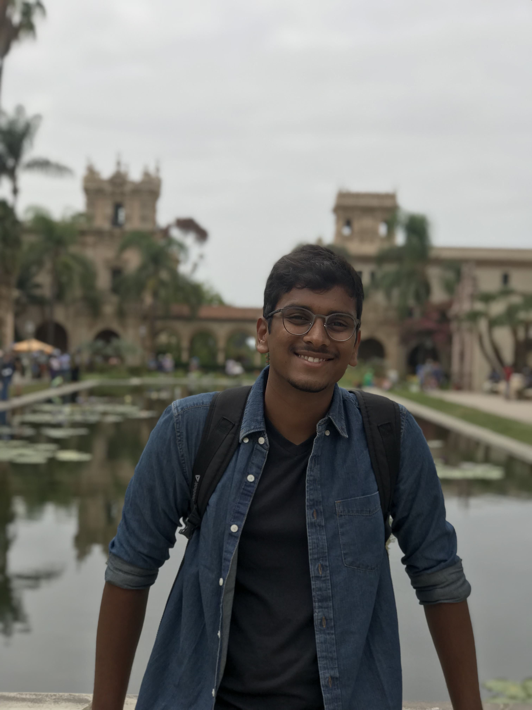

<!-- 
##### BLubble, a wordplay between BLE and bubble, conveys very succinctly what we intend to achieve. Basically, we want to utilize Bluetooth Low Energy (BLE) beacons in order to classify the 6ft safe bubble you should be in, to maximize your social distancing effectiveness until the COVID-19 pandemic subsides. To this end, we are utilizing crowd-sourced data collection via various data collection apps we have developed. Please checkout our [Data Collection](./categories) page to help us out by contributing to the project. The below figure visually illustrates our technical approach. -->

BluBLE, a wordplay between BLE and bubble, conveys very succinctly what we intend to achieve. We want to utilize Bluetooth Low Energy (BLE) beacons in order to create the 6 feet safe bubble around you at all times. BluBLE is designed to maximize your social distancing effectiveness and keep you informed about the interactions you have with others until the COVID-19 pandemic subsides. 

Our team is composed of a group of researchers from the Jacobs School of Engineering at University of California, San Diego. We are members of the <a href="https://wcsng.ucsd.edu">WCSNG Lab</a> (Wireless Communications Networks and Sensing) at UCSD. Under the guidance of you PI Prof. Dinesh Bharadia, we work very extensively in the field of wireless localization, which forms the very heart of contact tracing via bluetooth connections. 

Recent publications from the lab in the field of wireless localization include BLoc, LocAP, DLoc and more. These publications have appeared in some of the most prestigious conferences. Notably, algorithms framed by BLoc have also been adopted in the Bluetooth standards in order to obtain fine-grained localization. Feel free to browse our <a href="https://wcsng.ucsd.edu">lab webpage</a> to know more about our lab. 

<!--  -->

<!-- ##### We are members of the [WCSNG Lab](https://wcsng.ucsd.edu) (Wireless Communications Networks and Sensing), UCSD. The Lab is headed by [Prof. Dinesh Bharadia](http://web.eng.ucsd.edu/~dineshb/). We work very extensively in the field of wireless localization, which forms the very heart of this problem of contact tracing via bluetooth connections.  -->

<!-- ##### Recent publications from the lab in the field of wireless localization have been BLoc, LocAP, DLoc and more. Notably, algorithms framed by BLoc have also been adopted in the Bluetooth standards in order to obtain fine-grained localization. Feel free to browse our [lab webpage]((https://wcsng.ucsd.edu)) to know more about our lab. 
 -->

<h4> Team: </h4>

<h4> Dinesh Bharadia: Assistant Professor</h4>
<h5>Dept. of Electrical and Computer Engineering</h5>

I received my Ph.D. at Stanford University where I worked with Prof. Sachin Katti. From 2013 to 2015, I took a leave of absence from my Ph.D. to commercialize research on the practical full-duplex radio at Kumu Networks, which underwent successful field trials with tier 1 network providers worldwide – Deutsche Telekom and SK Telecom and is now being commercially deployed.

I research, design and develop systems that advance the theory and design of modern wireless communication systems, sensor networks, and data-center networks. Webpage <a href="http://web.eng.ucsd.edu/~dineshb/">Link</a>.

	

		
	

	

		<h5>Aditya Arun : PhD Student</h5>	
		
 Aditya's research currently focuses on realizing accurate indoor localization by introducing a new WiFi-based sensor modality using graph-based optimization techniques. 

	

	

		
	

	

		<h5>Agrim Gupta: PhD Student</h5>	
		
 Agrim's research interest is solving analysis-intensive problems stemming in Wireless Communications, involving topics like Indoor Positioning and Backscatter Communications. 

	

	

		
	

	

		<h5>Shivani Bhakta : UG Student</h5>	
		
 Shivani’s a Senior EE student focusing on Machine Learning and will be working on the BLE Localization at WCSNG.    

	

	

		
	

	

		<h5>Saikiran Komatineni: UG Student</h5>	
		
 Sai’s a Senior EE student focusing on Machine Learning, Robotics, and Control and has research experience in the field of 3D Reconstruction. 

	

