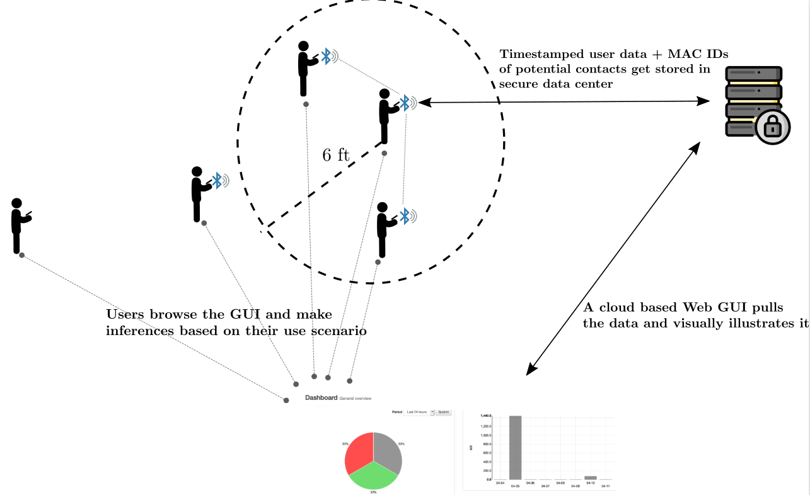

###### BLubble, a wordplay between BLE and bubble, conveys very succinctly what we intend to achieve. Basically, we want to utilize Bluetooth Low Energy (BLE) beacons in order to classify the 6ft safe bubble you should be in, to maximize your social distancing effectiveness until the COVID-19 pandemic subsides. To this end, we are utilizing crowd-sourced data collection via various data collection apps we have developed. Please checkout our [Data Collection](./categories) page to help us out by contributing to the project. The below figure visually illustrates our technical approach.

###### We are members of the [WCSNG Lab](https://wcsng.ucsd.edu) (Wireless Communications Networks and Sensing), UCSD. The Lab is headed by [Prof. Dinesh Bharadia](http://web.eng.ucsd.edu/~dineshb/). We work very extensively in the field of wireless localization, which forms the very heart of this problem of contact tracing via bluetooth connections. 

###### Recent publications from the lab in the field of wireless localization have been BLoc, LocAP, DLoc and more. Notably, algorithms framed by BLoc have also been adopted in the Bluetooth standards in order to obtain fine-grained localization. Feel free to browse our [lab webpage]((https://wcsng.ucsd.edu)) to know more about our lab. 
